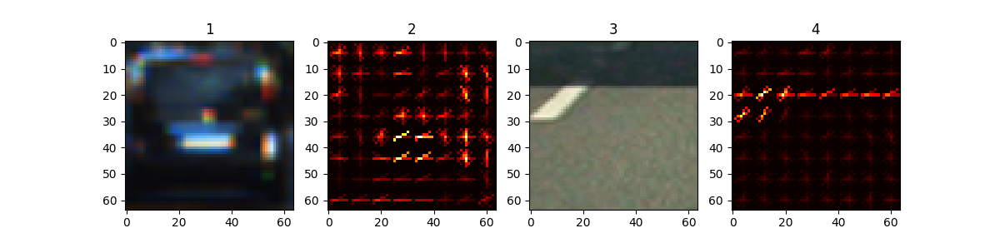
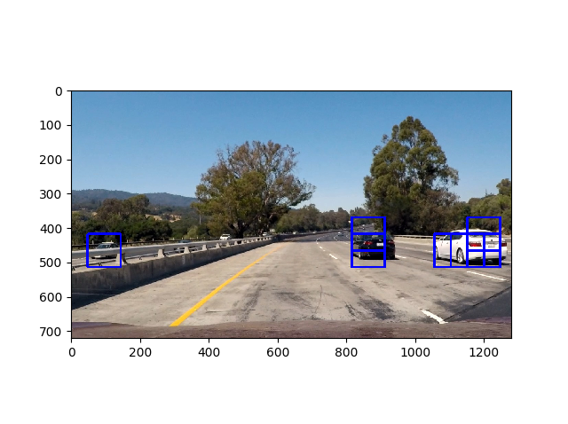
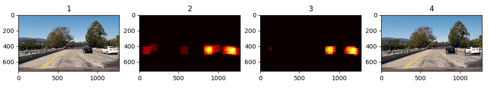
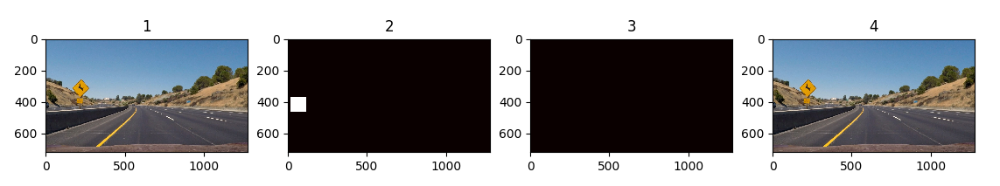
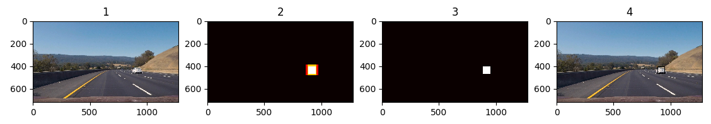
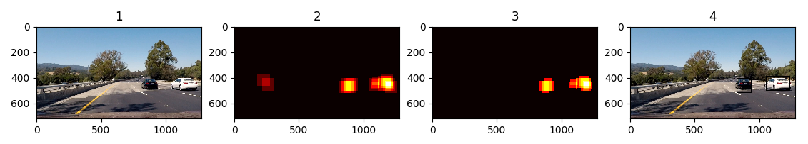
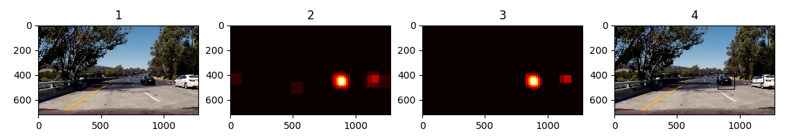
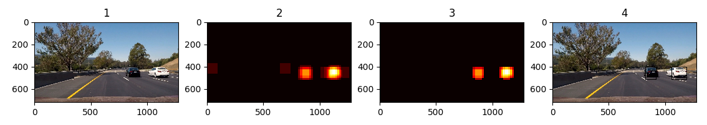

# Vehicle-Detection-and-Tracking
## Self-driving Car Engineer Nanodegree
***

## Introduction

The objective of this project is to detect and track vehicles in real-time. By extracting image features and training a machine learning classifier, we can detect and subsequently track surrounding vehicles. The additional lane line detection process can be found [Here](https://github.com/Cianrn/Advanced-Lane-Line-Detection-and-Tracking.git). The steps to this project are as follows: 
 
* Feature extraction: Histogram of Oriented Gradients(HOG) and other features
* Sliding window vehicle search 
* Train Support Vector Machine (SVM) classifier
* Run vehicle detection software pipeline 

## Feature Selection
### Spatial Binning

A downsampled image of specified spatial size (32,32) is used. Although we lower the image resolution, we retain enough feature information to identify vehicles.

### Histogram of Colors

Here we construct histograms of R,G and B channels. These histograms for each image are concatenated and become new feature vectors. `color_hist` found in `feature_function.py` is used to bin color features using the three color channels. With this, we look at areas with similar color distributions in order to identify vehicles.

### HOG Features
Here, we look at gradient magnitudes and directions of pixels within cell blocks. Within each cell block, a histogram reflecting gradient direction and magnitde is computed. The scikit-image package and `hog()` function is utilized for this. The function `get_hog_feature` in `feature_functions.py` is used to extract HOG features. An image is fed in with the appropriate paramaters:

* Orientation: 9
* Pixels per cell: 8
* Cells per block: 2
* hog_channel: All
* spatial_size: (32,32)
* hist_bins: 16

The paramaters chosen gave us the best results. An example of HOG features for car and non car is displayed below:

To improve computational efficiency, we found the HOG feature set for the entire image and then subsampled that image rather than finding the HOG features at each window. This is seen in the `find_cars` function.

## Train Support Vector Machone Classifier

Within `feature_functions.py`, the `extract_features` function takes in a list of images and returns a list of feature vectors for each particular input image which we use to train our SVM Classifier. SVM's are much quicker to train than Convolutional neural Networks and, on average, we got an accuracy of about 99%. The performance of our classifier is directly related to the features we extracted using `bin_spatial`, `color_hist` and `get_hog_features`. Features are normalized to zero mean and unit variance using `StandardScaler` from `sklearn.preprocessing`.

## Sliding Window

The `slide_windows` function slides through the image and saves window locations. The `search_window` function search each window and predicts whether there is a car present or not. It steps through the image and returns a list of windows where objects were detected. Predictions are found using `clf.predict()` based on the feature vectors. If predictions equal 1, we append to the list of detected objects. We also specify `y_start` and `y_stop` positions to identify our region of interest. In other words, we are only interested in the lower image region. Using the `draw_boxes` function, we then draw boxes around detected shapes. The result of a particular image is shown below.

HOG sub-sampling is used, as described above. The entire process is done `find_cars`, from feature extraction to sliding windows, classification within each window and finally box drawing around detected objects. We use three scales which influence the window size by effectively rescaling the entire image. We use a scale of 1, 1.5 and 2 which helps us identify images with varying relative sizes. 

## Duplicates and False Positives
***

Duplicates refer to areas where multiple windows detect the same object. False positives occur when the classifier believed to have seen a car when there was not. Both situations can be seen in the previous image. We use heatmaps to combine overlapping detections and remove false positives. The images below shows examples of multiple detections and false positives. Thresholds are used to remove unwanted and incorrect classifications. In general, correctly detected objects will have more overlapping boxes and thus higher pixel values will be seen in those areas. 

To fix this, we add heat (+1) to each pixel within the detected window as shown below. The "hot parts" of the image are where vehicles are. By also apply a threshold, we can remove false positives which we assume will have lower "heat". Boxes are then drawn around hot areas, removing duplicate detections also. Furthermore, we look at the sum of the past 10 frames in order to smooth the detections over time. A threshold of 15 was then applied to limit false positives. Some test results are shown below. The first image shows the original, the second and third illustrate before and after heatmap thresholding. Finally we have our end result on the far right.

## Video Pipeline
***

The results of our vehicle and lane detection and tracking is demonstrated [Here]('https://github.com/Cianrn/Vehicle-Detection-and-Tracking/blob/master/output_images/output2_detect.mp4'). We successfully identified and tracked vehicles and lane lines. Some limitations include the accurate size of our drawn boxes. They are not perfectly alligned with the vehicle which implies that the vehicle is smaller or bigger than it actually is. 

